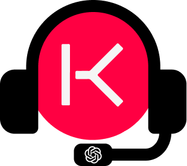

# ASKYO Email Assistant - Chrome Extension

Welcome to the KYO-Conseil Email Assistant Chrome Extension repository! Developed with JavaScript, this extension addresses the KYO-Conseil challenge by leveraging the GPT API to enhance email communication. Recognized as a top 5 finalist, our solution includes a certification to validate its achievement.

## Features

-   **GPT-Powered Assistance**: Integrate the GPT API for intelligent email suggestions.
-   **Voice Recognition**: Enjoy hands-free control with voice input.
-   **Tasks Management**: Streamlined user experience within the Chrome browser.

## Getting Started

1. Clone the repository.
2. Open Chrome and go to `chrome://extensions/`.
3. Enable "Developer mode" in the top right corner.
4. Click on "Load unpacked" and select the cloned repository folder.

## Video Presentation

Watch the video presentation for a quick overview of the extension's features.

## Certification

Our solution ranked among the top 5 finalists in the KYO-Conseil challenge. [View Certification](./assets/readme-assets/certificate.png)

Feel free to explore the codebase and contribute to the KYO-Conseil Email Assistant Chrome Extension!
